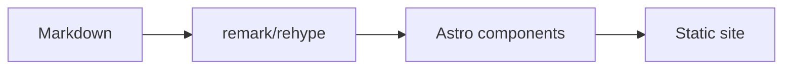

Astro Narrow is an Astro-native version of the Narrow reading experience. It uses content collections, typed config, Astro components, and build-time Markdown transforms instead of Hugo compatibility code.

## Configure `site.ts`

`src/config/site.ts` controls site identity, navigation, layout width, comments, analytics, gallery behavior, and post settings.

| Option | Purpose |
| --- | --- |
| `name`, `shortName`, `description` | Site metadata |
| `author` | Home profile card and social links |
| `contentWidth` | Main layout width |
| `ui.navbar.sticky` | Sticky navbar switch |
| `ui.dock.enabled` | Bottom dock switch |
| `nav` | Header navigation |
| `footerNav` | Footer navigation |
| `comments` | Giscus settings |
| `analytics` | Umami settings |
| `gallery`, `lightbox` | Markdown image behavior |
| `post.relatedCount` | Related post count |
| `post.license` | License block |

::::tabs
:::tab{title="Basic site"}
```ts
export const siteConfig = {
  name: 'Astro Narrow',
  shortName: 'Narrow',
  description: 'A content-focused Astro theme.',
  contentWidth: '56rem'
}
```
:::

:::tab{title="Navigation"}
```ts
export const siteConfig = {
  nav: ['posts', 'series', 'projects', 'archives'],
  footerNav: ['archives']
}
```
:::

:::tab{title="External link"}
```ts
export const siteConfig = {
  nav: [
    'posts',
    { label: { en: 'GitHub', 'zh-cn': 'GitHub' }, href: 'https://github.com/', icon: 'simple-icons:github' }
  ]
}
```
:::
::::

## Configure Content Types

`src/config/content.ts` defines how each content type appears in navigation, lists, cards, and home sections.

| Option | Values |
| --- | --- |
| `cardStyle` | `article`, `showcase`, `compact` |
| `listLayout` | `stack`, `grid` |
| `gridColumns` | `1`, `2`, `3` |
| `home.enabled` | Show the type on the home page |
| `home.limit` | Number of entries on the home page |
| `home.featuredOnly` | Only show featured entries |

```ts title="src/config/content.ts"
export const contentTypes = {
  posts: {
    collection: 'posts',
    path: '/posts/',
    label: { en: 'Posts', 'zh-cn': '文章' },
    cardStyle: 'article',
    listLayout: 'stack',
    gridColumns: 1
  }
}
```

## Frontmatter

Posts use Astro content collection fields. Keep frontmatter small and predictable.

| Field | Use |
| --- | --- |
| `title` | Page title |
| `description` | Summary and meta description |
| `pubDate` | Publish date |
| `updatedDate` | Optional update date |
| `cover` | Cover image |
| `categories` | Post categories used by Archives filtering |
| `tags` | Post tags used by Archives filtering |
| `toc` | `center`, `side`, `true`, or `false` |
| `comments` | Per-entry comments |
| `math`, `mermaid`, `gallery`, `lightbox` | Feature hints |

Categories and tags are discovered automatically from published posts in the current locale. Ordered reading paths are defined separately under `src/content/series/<locale>/`, so posts do not repeat Series names or chapter numbers. Projects keep their own tags for cards and search, but they do not appear in Archives. Project entries also support `featured` and `links`.

```yaml
links:
  - label: Website
    url: https://example.com
    icon: lucide:external-link
  - label: GitHub
    url: https://github.com/example/repo
    icon: simple-icons:github
featured: true
```

## Markdown Features

> [!NOTE]
> Prefer Markdown-native input. Astro Narrow transforms common patterns with remark and rehype.

| Feature | Input |
| --- | --- |
| Alerts | GitHub style blockquotes |
| Tabs | `::::tabs` and `:::tab{title="..."}` |
| Gallery | Consecutive Markdown images |
| Math | `$x^2$` and `$$...$$` |
| Mermaid | Fenced `mermaid` blocks |
| Code | Expressive Code fences |

### Code

```ts title="theme.ts" {3}
type ColorMode = 'light' | 'dark' | 'auto';

export function setMode(mode: ColorMode) {
  document.documentElement.classList.toggle('dark', mode === 'dark');
}
```

### Gallery


### Math and Mermaid

Inline math works as $E = mc^2$.


