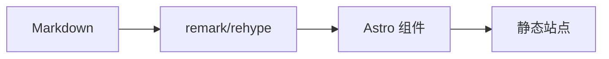

Astro Narrow 是 Narrow 阅读体验的 Astro-native 实现。它使用内容集合、类型化配置、Astro 组件和构建期 Markdown 转换，不保留 Hugo 兼容层。

## 配置 `site.ts`

`src/config/site.ts` 控制站点信息、导航、整体宽度、评论、统计、图库和文章设置。

| 配置 | 用途 |
| --- | --- |
| `name`, `shortName`, `description` | 站点元信息 |
| `author` | 首页个人信息卡片和社交链接 |
| `contentWidth` | 主体布局宽度 |
| `ui.navbar.sticky` | 是否固定导航栏 |
| `ui.dock.enabled` | 是否显示底部 dock |
| `nav` | 顶部导航 |
| `footerNav` | 底部导航 |
| `comments` | Giscus 配置 |
| `analytics` | Umami 配置 |
| `gallery`, `lightbox` | Markdown 图片行为 |
| `post.relatedCount` | 相关文章数量 |
| `post.license` | 版权许可区块 |

::::tabs
:::tab{title="基础信息"}
```ts
export const siteConfig = {
  name: 'Astro Narrow',
  shortName: 'Narrow',
  description: '一个内容优先的 Astro 主题。',
  contentWidth: '56rem'
}
```
:::

:::tab{title="导航"}
```ts
export const siteConfig = {
  nav: ['posts', 'series', 'projects', 'archives'],
  footerNav: ['archives']
}
```
:::

:::tab{title="外部链接"}
```ts
export const siteConfig = {
  nav: [
    'posts',
    { label: { en: 'GitHub', 'zh-cn': 'GitHub' }, href: 'https://github.com/', icon: 'simple-icons:github' }
  ]
}
```
:::
::::

## 配置内容类型

`src/config/content.ts` 定义每种内容在导航、列表、卡片和首页中的展示方式。

| 配置 | 可选值 |
| --- | --- |
| `cardStyle` | `article`, `showcase`, `compact` |
| `listLayout` | `stack`, `grid` |
| `gridColumns` | `1`, `2`, `3` |
| `home.enabled` | 是否在首页展示 |
| `home.limit` | 首页展示数量 |
| `home.featuredOnly` | 仅展示 featured 内容 |

```ts title="src/config/content.ts"
export const contentTypes = {
  posts: {
    collection: 'posts',
    path: '/posts/',
    label: { en: 'Posts', 'zh-cn': '文章' },
    cardStyle: 'article',
    listLayout: 'stack',
    gridColumns: 1
  }
}
```

## Frontmatter

文章使用 Astro content collections。建议保持 frontmatter 简洁稳定。

| 字段 | 用途 |
| --- | --- |
| `title` | 页面标题 |
| `description` | 摘要和 meta description |
| `pubDate` | 发布日期 |
| `updatedDate` | 可选更新日期 |
| `cover` | 封面图 |
| `categories` | 用于归档筛选的文章分类 |
| `tags` | 用于归档筛选的文章标签 |
| `toc` | `center`, `side`, `true`, `false` |
| `comments` | 单篇评论开关 |
| `math`, `mermaid`, `gallery`, `lightbox` | 功能提示 |

分类和标签会从当前语言的已发布文章中自动发现。有序阅读路径单独定义在 `src/content/series/<locale>/`，文章无需重复填写 Series 名称或章节序号。项目保留自己的标签，用于卡片和搜索，但不会出现在归档中。项目内容还支持 `featured` 和 `links`。

```yaml
links:
  - label: Website
    url: https://example.com
    icon: lucide:external-link
  - label: GitHub
    url: https://github.com/example/repo
    icon: simple-icons:github
featured: true
```

## Markdown 能力

> [!NOTE]
> 尽量使用 Markdown 原生输入。Astro Narrow 通过 remark 和 rehype 转换常见结构。

| 功能 | 输入方式 |
| --- | --- |
| 提示块 | GitHub 风格引用块 |
| Tabs | `::::tabs` 和 `:::tab{title="..."}` |
| 图库 | 连续书写 Markdown 图片 |
| 数学公式 | `$x^2$` 和 `$$...$$` |
| Mermaid | `mermaid` 代码块 |
| 代码块 | Expressive Code |

### 代码

```ts title="theme.ts" {3}
type ColorMode = 'light' | 'dark' | 'auto';

export function setMode(mode: ColorMode) {
  document.documentElement.classList.toggle('dark', mode === 'dark');
}
```

### 图库


### 数学和 Mermaid

行内公式：$E = mc^2$。


